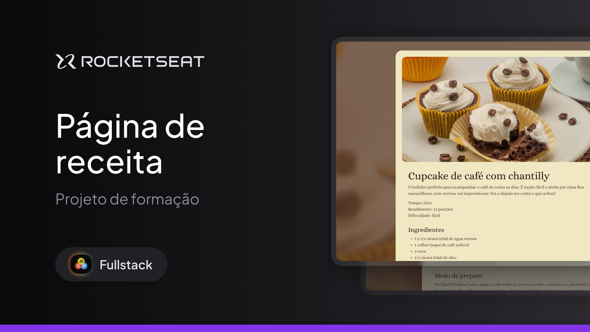

<h1 align="center"> Página de Receita </h1>

Esse projeto foi desenvolvido no curso Full Stack da Rocketseat!

  <a href="#-tecnologias">Tecnologias</a>&nbsp;&nbsp;&nbsp;|&nbsp;&nbsp;&nbsp;
  <a href="#-projeto">Projeto</a>&nbsp;&nbsp;&nbsp;|&nbsp;&nbsp;&nbsp;
  <a href="#-layout">Layout</a>&nbsp;&nbsp;&nbsp;|&nbsp;&nbsp;&nbsp;
  <a href="#memo-licença">Licença</a>

  

 

## 🚀 Tecnologias! 

Esse projeto foi desenvolvido com as seguintes tecnologias:

- HTML e CSS
- Git e Github
- Figma

## 💻 Projeto

O design foi elaborado com uma estética simples e elegante, utilizando cores suaves, bordas arredondadas, e uma tipografia amigável para facilitar a leitura. O layout é responsivo e foi construído exclusivamente com CSS e HTML, sem a utilização de bibliotecas ou frameworks.

## 🔖 Layout

Você pode visualizar o layout do projeto através [DESSE LINK](https://www.figma.com/design/568G2InzcGCOydgVNUlTDv/P%C3%A1gina-de-receita-(Community)?m=auto&t=XcfSBbU1cZTXVBX8-6). É necessário ter conta no [Figma](https://figma.com) para acessá-lo.

## 🌌 Ver Site 
Confira aqui: https://luisfelipets17.github.io/pagina-de-receitas/

## :memo: Licença

Esse projeto está sob a licença MIT.

---
